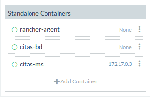

# 2g_citas_ms dop

Microservicio encargado de la gestión de citas, para la aplicación dop.

Se usa como lenguaje de base **Go**, el cual nos facilita la creación de aplicaciones enfocadas en web y nos brinda herramientas para la creación de servicios web.

Como base de datos se usa **mongoDB**, se escogió debido a que cada cita puede ser variable, tanto en el número de personas como en los lugares donde se realizara (itinerario), de esta forma podremos integrar un arreglo para estos campos, y consultarlos de forma mas sencilla.


### Dependencias:

1. mux para facilitar el CRUD REST:

  `go get github.com/gorilla/mux`

2. mgo para facilitar la conexión a mongodb:

  `go get gopkg.in/mgo.v2`


### Ejecución

En la carpeta del archivo ejecutar las siguientes instucciones:

1. Subir la bd a rancher e inicializarla:

`docker-compose up`

2. Subir el programa a Rancher

`docker build -t citas-ms .`

3. Iniciar el programa

`docker run --name citas-ms -p 3023:3300 citas-ms`

**Aclaración:** Los comandos se deben ejecutar desde la terminal, en la ruta del proyecto (1. en una terminal y 2.,3. desde otra terminal).

Con esto a tendremos en Rancher el servicio en ejecución



Ahora procedemos a ingresar a la dirección:
<http://192.168.99.101:3023> desde donde probaremos los diferentes servicios con la ayuda de postman.

CRUD | RUTA | ACCIÓN
---- | ---- | ------
POST | /citas | Crea una nueva cita con el JSON que se le envia.
GET  | /citas/{id} | Obtiene una cita, dado su id.
GET  | /citas/personas/{id} | Obtiene las citas de una persona en particular, dado su id.
PUT  | /citas/{id} | Actualiza la información de una cita, dado su id.
DELETE | /citas/{id} | Elimina una cita, dado su id.

Un ejemplo de JSON es el siguiente:

```json
{
    "Cita" : "Asunto",
    "Lugar" : 1,
    "Fecha" : "AAAA-MM-DD HH:MM",
    "Personas" : [
        1,
        3
    ],
    "Estado" : "Activo",
    "Visibilidad":false
}
```
